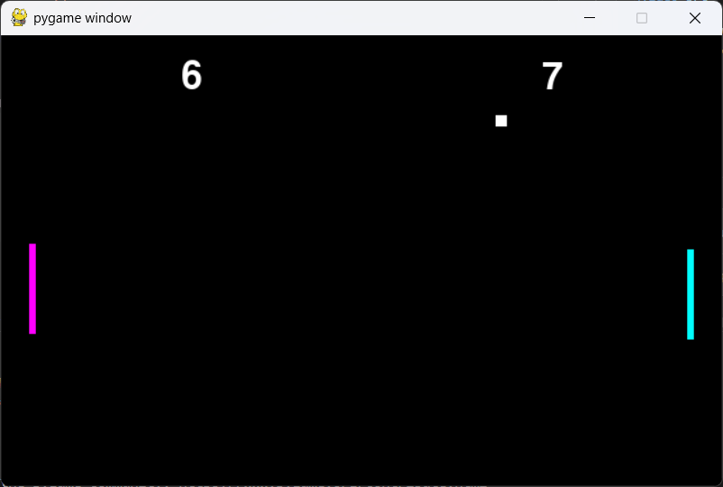

# pong

A LAN-multiplayer Pong game in Python/pygame, plus the raw-socket scripts used to prototype the networking.



<video src="pong/pongrec.mp4" controls width="640"></video>

*(if the video doesn't render above, it's [pong/pongrec.mp4](pong/pongrec.mp4))*

Two-player Pong over a LAN socket connection, plus a single-player local version.

- [pong/pong.py](pong/pong.py) — single-player/local, both paddles on one keyboard (W/S and Up/Down).
- [pong/pong_server.py](pong/pong_server.py) — host. Controls the left paddle (W/S), listens on port `5555`, and simulates the game (ball physics, scoring, paddle spin).
- [pong/pong_client.py](pong/pong_client.py) — client. Connects to the host, controls the right paddle (Up/Down), and just renders the state it receives.
- [pong/server_test.py](pong/server_test.py) / [pong/client_test.py](pong/client_test.py) — minimal raw-socket send/receive scripts used to sanity-check the networking before wiring it into the game.

## Running it

Requires `pygame`:

```bash
pip install pygame
```

On the host machine:

```bash
python pong/pong_server.py
```

It prints "Waiting for Player 2 to connect..." and blocks until a client connects.

On the client machine (edit `HOST` in [pong/pong_client.py](pong/pong_client.py) to the host's LAN IP if not running on the same machine):

```bash
python pong/pong_client.py
```

Controls:
- Host (left paddle): `W` / `S`
- Client (right paddle): `Up` / `Down`
